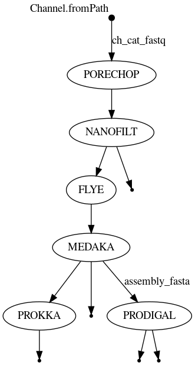
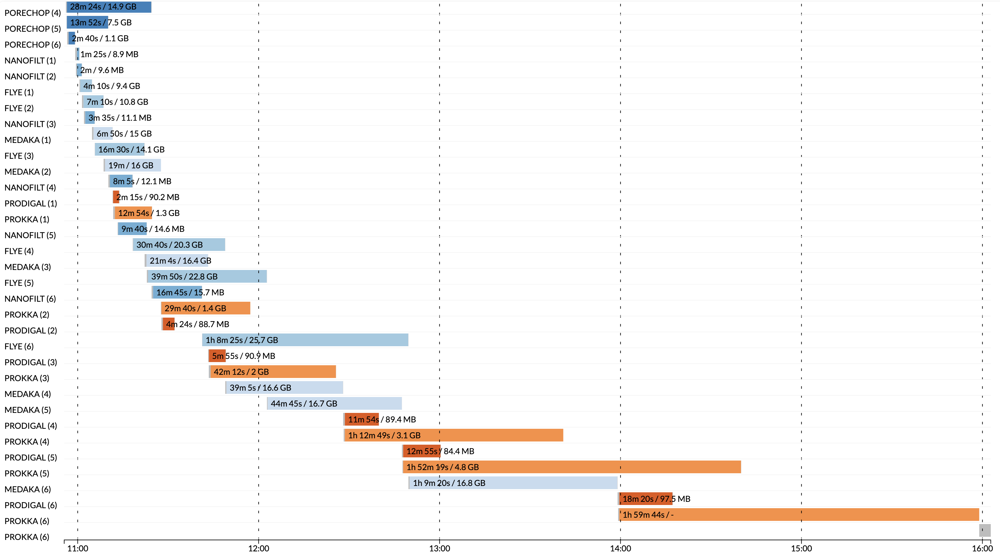

# Nanopore metagenomics pipeline (Nextflow)

Here is a Nextflow pipeline to assemble Nanopore reads from isolates containing bacterial species. It is currently being adapted from shell scripts based on (this repository). 

 Main tasks are QC, assembly, annotation and identification. It is configured for both local (desktop) and HPC, showing tractable scaling potential. 

I have modified it to run samples in parallel, employ both conda and apptainer software sources, and use higher throughput tools. I have also simplified its result and artifact products. 

## Pipeline 

This graph is updated as the workflow expands to incorporate original pipeline elements. 

## Performance 

## Data 

Human oral swabs from (SRA) downsampled for scaling analysis. 